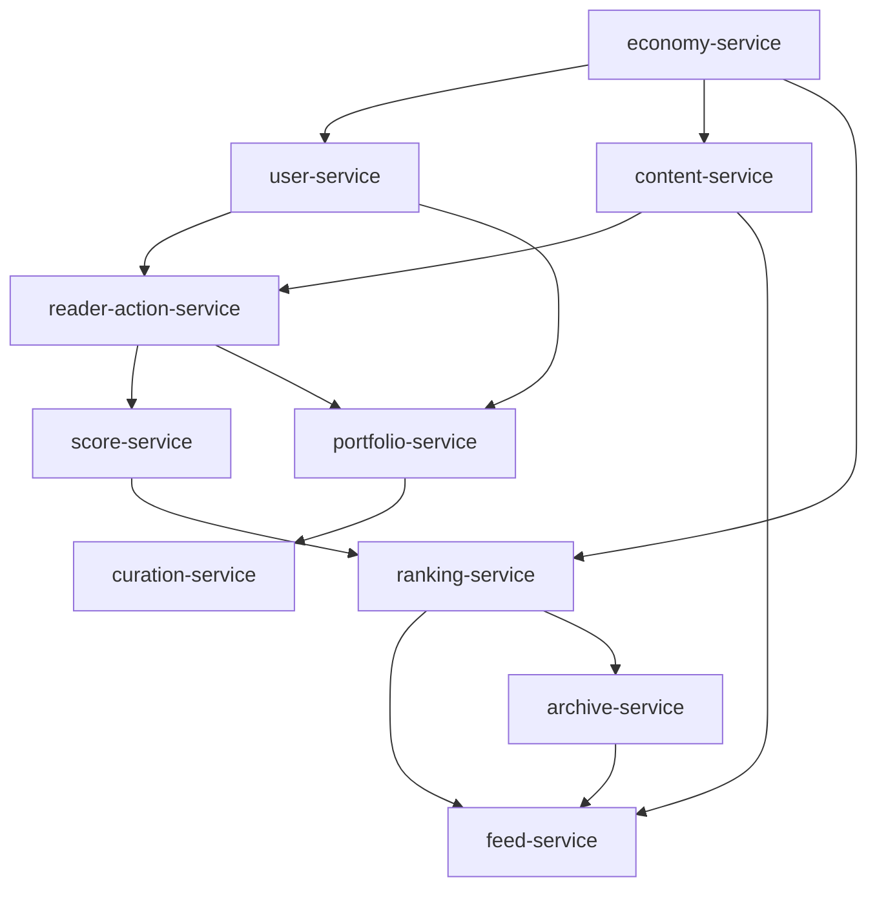

# Depend on you domain.md 1.0

# [domains.md](http://domains.md/) – マイクロサービス構成（Depend on You）

## 1. マイクロサービス化の目的

- **責任の明確化と分担最適化**
    
    各サービスに「1サービス1責任」を持たせ、独立開発・拡張・保守を可能にする。
    
    各AIエージェントに明確な作業範囲を与え、混乱を回避する。
    
- **AIエージェントの最適活用**
    
    各サービス単位で必要なドキュメントのみを与え、処理対象のコンテキストを限定。
    
    外部の知識に依存せず、構造化された作業が可能になる。
    
- **疎結合なアーキテクチャ構築**
    
    サービス間は明確なAPI契約で接続し、変更の影響範囲を最小化。
    
    相互に密結合せず、独立デプロイや分散スケーリングが可能。
    
- **将来的なスケーリングや分業対応**
    
    特定のサービス（例：ranking-service）のみ負荷分散・言語移行・切替可能にする。
    

---

## 2. 設計方針

- **原則「1サービス1責任」**
- **サービス間の依存は一方向（上流 → 下流）**
- **サービスごとに以下のドキュメントを持つ：**
    - `service.md`：目的・責務
    - `spec.md`：API仕様・DB構造
    - `test.md`：テスト仕様
- **共通スキーマは shared/schema.ts に集約**
- **全体構成はこの [domains.md](http://domains.md/) に記載**

---

## 3. サービス一覧と責務（詳細）

### user-service

- 認証、プロフィール、信用スコア管理
- 他サービスのスコア補正・報酬分配で参照される

### content-service

- 作品・連載・話の投稿、更新、取得、完結処理
- メタ情報（ジャンル・タグ等）も含む

### reader-action-service

- 読者アクション（ブースト、保存、再読、コメント、感情リアクション）の記録
- 全アクションはスコア算出やポートフォリオに利用される

### score-service

- アクションログから作品スコアを計算
- 信用スコア補正や読了率、保存率などを使用

### ranking-service

- スコアを元にクラスタ別・全体のランキング生成
- トレンドや再評価対象の特定も行う

### feed-service

- ランキング・嗜好・コンテンツ情報に基づき、個別フィード生成
- 単話配信・連載表示に対応

### portfolio-service

- 読者の行動履歴をポートフォリオとして可視化
- 信用スコアの根拠表示、貢献度証明としても機能

### curation-service

- 読者によるプレイリスト・レビューの作成・管理
- 他読者やアルゴリズムによる作品再発見に貢献

### archive-service

- 完結作品の保存と再評価処理
- 再浮上した作品をフィードに再投入する機能を持つ

### economy-service

- 広告・課金・グッズ売上の集計
- 作者・読者・運営への報酬ポイント配分

---

## 4. サービス依存関係図

